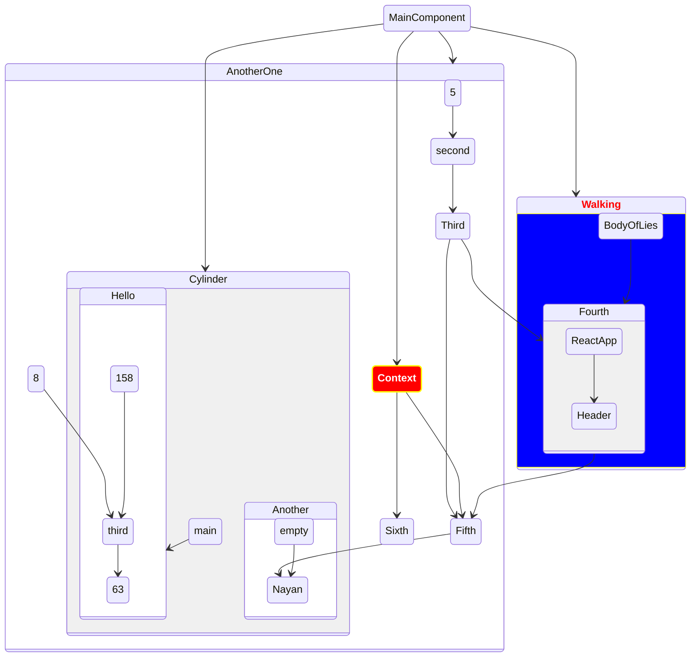

    <h1 align="center">
    <a>Framer Motion Basics</a>
    </h1>

```mermaid

stateDiagram-v2
classDef amar fill:#f00,color:white,font-weight:bold,stroke-width:2px,stroke:yellow

classDef whoKnows fill:blue,color:red,font-weight:bold,stroke-width:1px,stroke:yellow

     MainComponent  --> Context ::: amar
     MainComponent  --> Cylinder
     MainComponent  --> Walking ::: whoKnows
     MainComponent  --> AnotherOne

    state Walking {
        state Fourth {
         ReactApp --> Header
        }
            
        BodyOfLies --> Fourth
        Fourth --> Fifth
        Third --> Fourth
        Third -->Fifth
        Fifth --> Nayan
    }
    state AnotherOne {
            5 --> second
            8 --> third
            Context --> Fifth
            Context --> Sixth
            second --> Third

            state Cylinder {
                main --> Hello
                state Another {
                       empty --> Nayan 
                }
                state Hello {
                    158 --> third
                third --> 63
                }
            }
        }
```